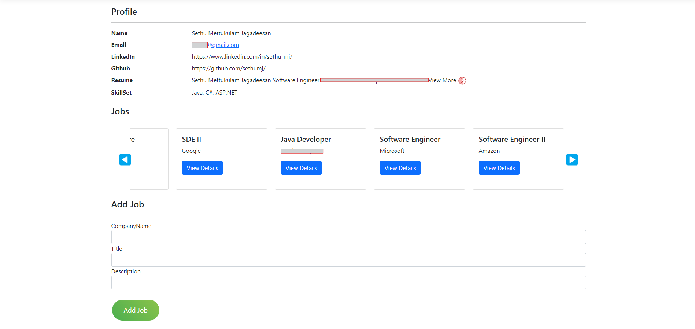

# AppEase
# Job Application Tracker with Custom Cover Letter Generation



## Overview
This ASP.NET web application helps users track their job applications and profiles, and generates customized cover letters using Azure OpenAI. The application uses MySQL for the database and Entity Framework for database management.

## Features
- **Job Application Tracking:** Keep track of all job applications and profiles in one place.
- **Customized Cover Letters:** Generate personalized cover letters using Azure OpenAI.
- **Database Management:** Uses MySQL and Entity Framework to manage and interact with the database efficiently.

## Technologies Used
- **ASP.NET Core**
- **C#**
- **MySQL**
- **Entity Framework Core**
- **Azure OpenAI**
- **HTML/CSS**
- **JavaScript**

## Getting Started

### Prerequisites
- .NET 6.0 SDK or later
- MySQL Server
- Azure OpenAI API Key

### Installation

1. **Clone the repository:**
   ```bash
   git clone https://github.com/sethumj/AppEase.git
   cd AppEase
